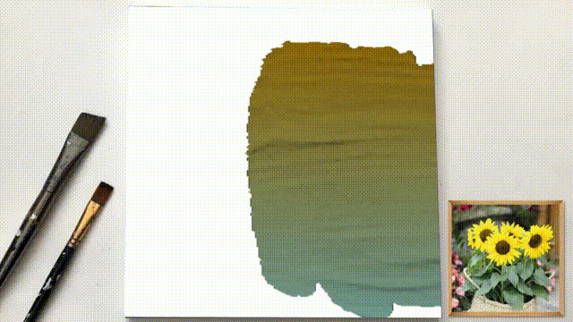
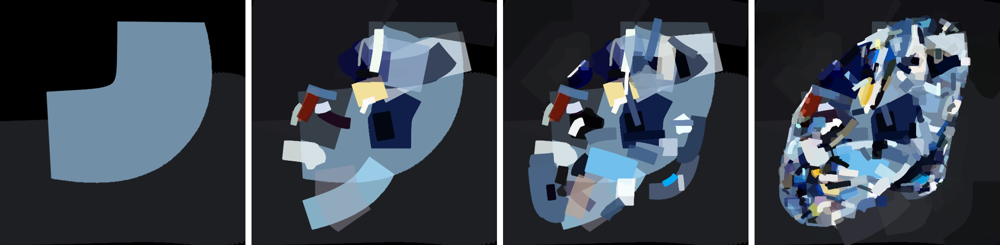
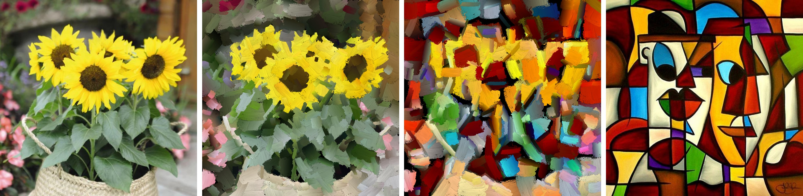
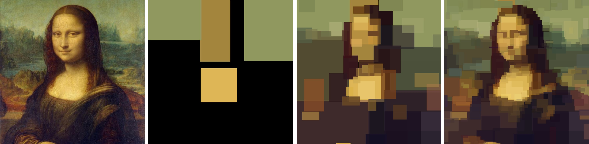

# Stylized Neural Painting 

[Preprint](<https://arxiv.org/abs/2011.08114>) | [Project Page](<https://jiupinjia.github.io/neuralpainter/>)  | [Colab Runtime 1](<https://colab.research.google.com/drive/1XwZ4VI12CX2v9561-WD5EJwoSTJPFBbr?usp=sharing/>)  | [Colab Runtime 2](<https://colab.research.google.com/drive/1ch_41GtcQNQT1NLOA21vQJ_rQOjjv9D8?usp=sharing/>) 

### Official Pytorch implementation of the preprint paper "Stylized Neural Painting", in arXiv:2011.08114.

We propose an image-to-painting translation method that generates vivid and realistic painting artworks with controllable styles. Different from previous image-to-image translation methods that formulate the translation as pixel-wise prediction, we deal with such an artistic creation process in a vectorized environment and produce a sequence of physically meaningful stroke parameters that can be further used for rendering. Since a typical vector render is not differentiable, we design a novel neural renderer which imitates the behavior of the vector renderer and then frame the stroke prediction as a parameter searching process that maximizes the similarity between the input and the rendering output. Experiments show that the paintings generated by our method have a high degree of fidelity in both global appearance and local textures. Our method can be also jointly optimized with neural style transfer that further transfers visual style from other images.




In this repository, we implement the complete training/inference pipeline of our paper based on Pytorch and provide several demos that can be used for reproducing the results reported in our paper. With the code, you can also try on your own data by following the instructions below.

The implementation of the sinkhorn loss in our code is partially adapted from the project [SinkhornAutoDiff](https://github.com/gpeyre/SinkhornAutoDiff).


### License
<a rel="license" href="http://creativecommons.org/licenses/by-nc-sa/4.0/"></a><span xmlns:dct="http://purl.org/dc/terms/" property="dct:title">  Stylized Neural Painting</span> by <a xmlns:cc="http://creativecommons.org/ns#" href="http://www-personal.umich.edu/~zzhengxi/">Zhengxia Zou</a> is licensed under a <a rel="license" href="http://creativecommons.org/licenses/by-nc-sa/4.0/">Creative Commons Attribution-NonCommercial-ShareAlike 4.0 International License</a>.


### One-min video result

[](https://www.youtube.com/watch?v=oerb-nwrXhk)


## Requirements

See [Requirements.txt](Requirements.txt).


## Setup

1. Clone this repo:

```bash
git clone https://github.com/jiupinjia/stylized-neural-painting.git 
cd stylized-neural-painting
```

2. Download one of the pretrained neural renderers from Google Drive (1. [oil-paint brush](https://drive.google.com/file/d/1sqWhgBKqaBJggl2A8sD1bLSq2_B1ScMG/view?usp=sharing), 2. [watercolor ink](https://drive.google.com/file/d/19Yrj15v9kHvWzkK9o_GSZtvQaJPmcRYQ/view?usp=sharing), 3. [marker pen](https://drive.google.com/file/d/1XsjncjlSdQh2dbZ3X1qf1M8pDc8GLbNy/view?usp=sharing), 4. [color tapes](https://drive.google.com/file/d/162ykmRX8TBGVRnJIof8NeqN7cuwwuzIF/view?usp=sharing)), and unzip them to the repo directory.

```bash
unzip checkpoints_G_oilpaintbrush.zip
unzip checkpoints_G_rectangle.zip
unzip checkpoints_G_markerpen.zip
unzip checkpoints_G_watercolor.zip
```

   


## To produce our results

#### Photo to oil painting


- Progressive rendering

```bash
python demo_prog.py --img_path ./test_images/apple.jpg --canvas_color 'white' --max_m_strokes 500 --max_divide 5 --renderer oilpaintbrush --renderer_checkpoint_dir checkpoints_G_oilpaintbrush 
```

- Rendering directly from mxm image grids

```bash
python demo.py --img_path ./test_images/apple.jpg --canvas_color 'white' --max_m_strokes 500 --m_grid 5 --renderer oilpaintbrush --renderer_checkpoint_dir checkpoints_G_oilpaintbrush
```


#### Photo to marker-pen painting



- Progressive rendering

```bash
python demo_prog.py --img_path ./test_images/diamond.jpg --canvas_color 'black' --max_m_strokes 500 --max_divide 5 --renderer markerpen --renderer_checkpoint_dir checkpoints_G_markerpen 
```

- Rendering directly from mxm image grids

```bash
python demo.py --img_path ./test_images/diamond.jpg --canvas_color 'black' --max_m_strokes 500 --m_grid 5 --renderer markerpen --renderer_checkpoint_dir checkpoints_G_markerpen
```


#### Style transfer



- First, you need to generate painting and save stroke parameters to output dir

```bash
python demo.py --img_path ./test_images/sunflowers.jpg --canvas_color 'white' --max_m_strokes 500 --m_grid 5 --renderer oilpaintbrush --renderer_checkpoint_dir checkpoints_G_oilpaintbrush --output_dir ./output
```

- Then, choose a style image and run style transfer on the generated stroke parameters

```bash
python demo_nst.py --renderer oilpaintbrush --vector_file ./output/sunflowers_strokes.npz --style_img_path ./style_images/fire.jpg --content_img_path ./test_images/sunflowers.jpg --canvas_color 'white' --renderer_checkpoint_dir checkpoints_G_oilpaintbrush --transfer_mode 1
```

You may also specify the --transfer_mode to switch the transfer mode (0: transfer color only, 1: transfer both color and texture)

Also, please note that in the current version, the style transfer are not supported by the progressive rendering mode. We will be working on this feature in the near future. 


#### Generate 8-bit graphic artworks



```bash
python demo_8bitart.py --img_path ./test_images/monalisa.jpg --canvas_color 'black' --max_m_strokes 300 --max_divide 4
```


## Google Colab

Here we also provide a minimal working example of the inference runtime of our method. Check out the following runtimes and see your result on Colab.

[Colab Runtime 1](https://colab.research.google.com/drive/1XwZ4VI12CX2v9561-WD5EJwoSTJPFBbr?usp=sharing/) : Image to painting translation (progressive rendering)

[Colab Runtime 2](https://colab.research.google.com/drive/1ch_41GtcQNQT1NLOA21vQJ_rQOjjv9D8?usp=sharing/) : Image to painting translation with image style transfer 


## To retrain your neural renderer

You can also choose a brush type and train the stroke renderer from scratch. The only thing to do is to run the following common. During the training, the ground truth strokes are generated on-the-fly, so you don't need to download any external dataset. 

```bash
python train_imitator.py --renderer oilpaintbrush --net_G zou-fusion-net --checkpoint_dir ./checkpoints_G --vis_dir val_out --max_num_epochs 400 --lr 2e-4 --batch_size 64
```


## Citation

If you use this code for your research, please cite our paper:

``````
@inproceedings{zou2020stylized,
    title={Stylized Neural Painting},
      author={Zhengxia Zou and Tianyang Shi and Shuang Qiu and Yi Yuan and Zhenwei Shi},
      year={2020},
      eprint={2011.08114},
      archivePrefix={arXiv},
      primaryClass={cs.CV}
}
``````

